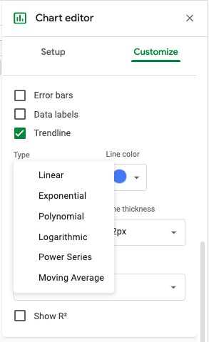
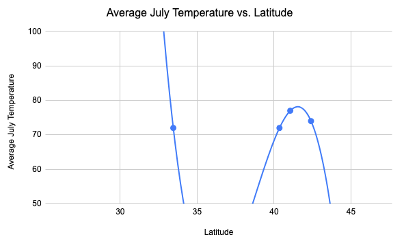

<!-- Copyright (C)  Google, Runestone Interactive LLC
  This work is licensed under the Creative Commons Attribution-ShareAlike 4.0
  International License. To view a copy of this license, visit
  http://creativecommons.org/licenses/by-sa/4.0/. -->

Non-Linear Regression
=====================

Up to this point you've only fit straight lines to data, but Sheets can
fit other trendlines to data as well, including exponential, polynomial,
logarithmic and more. You can access these other options from the chart
editor.

To change the type of a trendline in sheets you can go to \"Chart
Editor\" \> "Customize Menu" \> "Series," and after checking the
trendline option, you can select "Type." Then you will see a dropdown
menu with different types of trendlines.

For example, the number of users of a certain popular website grew
dramatically between 2004 and 2010. In this case, the linear trendline,
on the left, does not fit the exponential growth seen in number of
users. The exponential curve, on the right, fits this example much
better.

You should be careful when choosing trendline type. For example, a
polynomial curve can be fit to the latitude and January temperature
data.

But, in this case, switching to a polynomial curve doesn't help explain
the relationship between latitude and January temperature since the
temperature should get *colder* as the latitude of the city increases,
not warmer as the curve indicates. This curve, like the line of best
fit, is sensitive to the outlier of Juneau, which is much further north
than the other cities. It is better to first try linear regression and
check if it fits the data, before moving on to non-linear regression.

**Overfitting** is when your predictive line or curve fits too closely
to a particular set of data, and may not make reliable predictions for
other sets of data. For example, consider a set of temperature and
latitude data with only five cities. When looking at only these five
data points, the trend seems curved, and this fourth degree polynomial
curve fits nicely!

But as more cities are added in, it becomes apparent that this trendline
doesn't fit new cities at all. The polynomial curve was overfit to the
data, and a linear regression line would have predicted the other cities
better. This can be seen below when comparing the top and bottom graph.

The complete set of July temperatures, in red, has a strong, linear
trend. The dataset with only five cities appeared to have a curve
because the number of cities was so small. When you only have a few data
points in your sample, you can always find a polynomial curve that
passes through that small number of points. But these curves often
don\'t describe the larger collection of numbers any better than a
straight line. Unless you have a good reason to think the data should be
curved (for example, if you have some domain knowledge which predicts a
polynomial relationship), a straight line is the best choice.