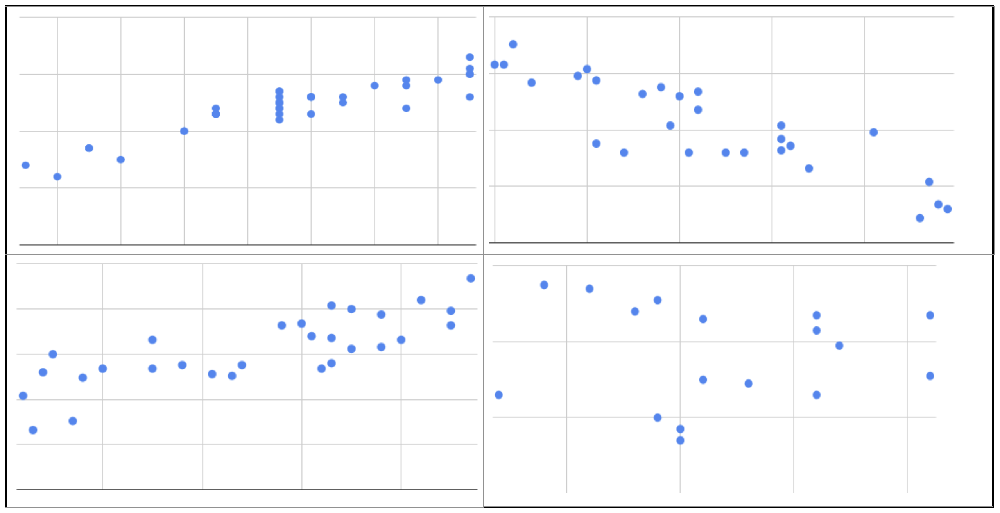
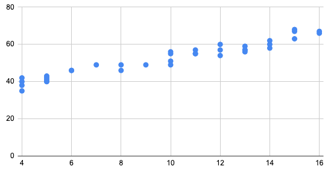

<!-- Copyright (C)  Google, Runestone Interactive LLC
  This work is licensed under the Creative Commons Attribution-ShareAlike 4.0
  International License. To view a copy of this license, visit
  http://creativecommons.org/licenses/by-sa/4.0/. -->

Correlation
===========

The **correlation coefficient** is a measure of the strength and
direction of the linear relationship between two quantitative variables.
It is denoted as *r*, and is always between -1 and 1. Here are some
examples of scatterplots and their corresponding correlation
coefficients.

As you can see, in the first row of the examples above, the closer the
points are to lying on a straight line, the closer the correlation is to
either 1 or -1. If the scatter plot has a positive direction, the
correlation is a positive number, and if the scatter plot has a negative
direction, the correlation is a negative number.

Correlation only measures the strength of linear relationships between
variables. The last row of examples shows a variety of scatter plots
where there is clearly an interesting relationship between the two
variables (note all the unique shapes!), but the correlation is 0
because the relationship is nonlinear. [Read this for more detail about
how correlation is
calculated.](https://www.statisticshowto.datasciencecentral.com/probability-and-statistics/correlation-coefficient-formula/#Pearson)

### Fill in the blank

Using the above figure as a guide, match the correlation to
each of the scatterplots from previous questions.

1. 0.79 
  
2. 0.02
  
3. -0.83
  
4. 0.92

You can use Sheets to find correlation using the *CORREL* function.

[Video - how to find correlation in
sheets.](https://www.youtube.com/watch?v=omIT5V7naqM)

A common, related value is *r2*, called the **coefficient of
determination**. **The coefficient of determination is the proportion
of variation explained by the explanatory variable.** It can be
calculated by squaring the correlation coefficient. The closer *r2* is
to 1, the closer *r* was to either 1 or -1, and thus the stronger the
relationship between the variables. The coefficient of determination is
useful when you're only interested in strength, rather than strength and
direction.

### Short answer

- Which would have the largest *r2* value?

### Multiple Choice

5. Which of the following r values would have the largest *r2* value?

**A.** 0.7

**B.** -0.1

**C.** 0.9 (correct)

**D.** 0.05

Answers

 
 
1. Bottom right. Positive and strong, but not as strong as top right.

2. Bottom left. No real relationship.

3. Top left. Negative and strong. 

4. Top right. Positive and strongest.
 
5. C. 0.9

