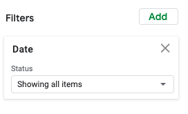
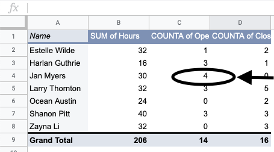
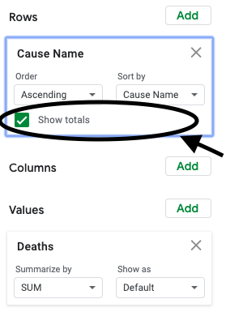
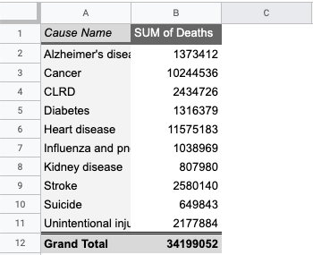

.. Copyright (C)  Google, Runestone Interactive LLC
   This work is licensed under the Creative Commons Attribution-ShareAlike 4.0
   International License. To view a copy of this license, visit
   http://creativecommons.org/licenses/by-sa/4.0/.

.. _pivot_tables:

Pivot Tables
============

Tables that show the average or total for different groups are often very
helpful. Suppose some coworkers at a local company aren’t sure if `the hours for
which they are each scheduled have been assigned fairly
<https://docs.google.com/spreadsheets/d/1wJlGc0z1_LaVy4NccEN65frFBU5grnQ5hCJ-iKmskSc/edit?usp=sharing>`__.
A table showing each employee, the hours they had been assigned and how often
they opened or closed the business could be used to see if there were big
differences in assignments, and decide if those assignments were fair. 

.. image:: figures/employee_table.png
   :alt: A screenshot of pivot table with example employee hours.
   :align: center

A **pivot table** is a table that allows you to pull relevant summary 
statistics from a dataset. You could use AVERAGEIF, SUMIF and COUNTIF to make
the table, but sheets has a built in tool to create a pivot table that 
automates this process without having to type out all the formulas. 

Start by selecting the data you’d like to use. Then navigate to the “Data” menu, 
and select “Pivot table”. You can place the new pivot table in a new sheet or 
an existing sheet.

.. image:: figures/pivot_table_select_data.png
   :alt: A screenshot of how to select pivot table from Data meu.
   :align: center

The pivot table editor, which opens on the right, has sections for adding rows,
columns, values, and filters.

-  Adding variables to **rows** or **columns** creates groupings based on that
   variable, displayed either as rows or columns of the pivot table. For
   example, when you select “Name” as a variable under rows, the pivot table
   will have one row for each of the employees at the company.

.. image:: figures/pivot_table_select_row.png
   :alt: A screenshot of adding a row in pivot table editor.
   :align: center

-  Adding a variable to **values** populates the cells of the table.

   -  If you want the total number of hours each employee at the company was
      assigned, select the value “Hours” and summarize by sum. This will add the
      total number of hours each employee was assigned to the table.

   .. image:: figures/pivot_table_select_values_hours.png
      :alt: A screenshot of adding a value for "Hours" in pivot table editor.
      :align: center

   -  If you want the total number of opening shifts each employee at the
      company was assigned, select the value “Opening Shift” and summarize by
      count. This will add the number of opening shifts each employee was
      assigned to the table as an additional column. 

   .. image:: figures/pivot_table_select_values_os.png
      :alt: A screenshot of adding a value for "Opening Shift" in pivot table editor.
      :align: center

   Repeating this process with “Closing Shift” will add a column showing the
   number of closing shifts for each employee.

-  Adding a variable to **filters** subsets the data before the pivot table is
   constructed. For example, a filter can be added on the “Date” variable for
   only the days July 4 - July 6. 
   

The resulting pivot table would have the total hours, opening and closing 
shift for only those three days.

.. image:: figures/adding_a_variable_pivot.png
   :alt: A screenshot of adding a variable in pivot table editor.
   :align: center

.. mchoice:: most_openings
   :answer_a: Jan Myers
   :answer_b: Larry Thornton
   :answer_c: Harlan Guthrie
   :correct: a

   Who was assigned the most opening shifts?

.. mchoice:: least_hours
   :answer_a: Harlan Guthrie
   :answer_b: Jan Myers
   :answer_c: Zayna Li
   :correct: a

   Who was assigned the smallest number of hours?

.. shortanswer:: fair_shifts

   What evidence from the table would support the employees’ claim that the assignments have not been assigned fairly?

   
Within a pivot table, double clicking on any value in the table will create a
new sheet with the subset of data from that entry in the table. For example,
double clicking on the value 4 in cell C4 in the table above creates the
sheet below. You can use this subset to look at Jan’s assignments, and ask
or answer questions about Jan specifically. This is also a great way to
investigate interesting values or patterns in a pivot table.

.. image:: figures/jan_meyers.png
   :alt: A screenshot of a pivot table with a Jan filter.
   :align: center

Example: National Center for Health Statistics
----------------------------------------------

For this example, consider a non-profit organization that works to improve the
life expectancy of Americans. You have access to data from The National Center
for Health Statistics (NCHS), which is a branch of the Center for Disease 
Control, that provides statistical information about the health of American 
people. `The dataset below presents the number of deaths for the ten leading 
causes of death in the USA for each state beginning in 1999.
<https://docs.google.com/spreadsheets/d/1fCaevMSqlbq9lGJhqYVp8f_UWcKV4mCA5q81YJsQ0M8/edit?usp=sharing>`__

.. image:: figures/leading_cause_of_death.png
   :alt: A screenshot of a sheet with leading cause of death data.
   :align: center

.. fillintheblank:: 2007_NV_cancer

   How many people died from cancer in Nevada in 2007? |blank|

   - :answer: 4331

You are working on a project for your nonprofit to try to find the leading
causes of death in the USA, in order to target possible areas of improvement for
healthcare and death prevention. This can be done given the NCHS dataset above.

First, construct a pivot table with rows from the variable “Cause Name”. 

.. image:: figures/pivot_table_cause_name.png
   :alt: A screenshot of creating a pivot table with rows from "Cause Name".
   :align: center

Then add “Deaths” as a value to the pivot table.

.. image:: figures/pivot_table_value_death.png
   :alt: A screenshot of adding value "Deaths" in value in pivot table editor.
   :align: center

Summarize by *SUM*. (There are many options under summarize. Sum is the most 
useful for this context, but average, median, and count are also commonly used 
statistics in pivot tables.) 

.. image:: figures/pivot_table_death_summary.png
   :alt: A screenshot of summarizing by sum for value "Deaths" in pivot table editor.
   :align: center

Make sure to have “Grand totals” enabled, so you can see the total 
number of deaths.

This is what the completed table should look like:

The cause of death responsible for the most deaths in the USA is heart disease.
But what percentage of deaths is this? To calculate the percentage, you can add
a column next to the pivot table that divides the deaths for each cause by the
grand total.(This is an opportunity to use absolute references to make 
your life simpler.)

.. image:: figures/death_sums.png
   :alt: A screenshot of how to use absolute reference to add a coloumn for percentages in pivot table.
   :align: center

This shows that 33.8% (or over one third!) of deaths in the USA are due to 
heart disease. This is astonishingly high, and shows that efforts towards 
reducing heart disease or ameliorating symptoms due to heart disease is the 
highest priority for the nonprofit.

.. fillintheblank:: smallest_death_cause

   Which cause, out of these top ten, has the smallest share of deaths? |blank|

   - :answer: Suicide

.. fillintheblank:: percent_stroke_deaths

   What percent of the deaths represented in this table are due to stroke? |blank|

   - :answer: 7.5%

.. fillintheblank:: top_two

   What percentage of the deaths in this dataset do the top two causes of deaths account for? |blank|

   - :answer: 63 - 64%

In order to present this information to your teammates, it might be easier to
display this information as a chart, rather than a table. A bar chart,
constructed from this pivot table, should make the information significantly
easier to interpret, compared to the raw pivot table.

To do this, first select the first two coloumns with the relevant data and 
select "Insert > Chart". 

.. image:: figures/pivot_table_insert_chart.png
   :alt: A screenshot of inserting a chart. 
   :align: center

Then in the chart editor select the chart type to be "Column Chart".

.. image:: figures/pivot_table_column_chart.png
   :alt: A screenshot of selecting "Coloumn Chart" in Chart Editor. 
   :align: center

Make sure that the "X-Axis" is set to the cells with the disease names and the 
"Series" is set to the sum of deaths for each disease. 

You should now have the chart below.

.. image:: figures/death_bar_chart.png
   :alt: A screenshot of complete bar chart for leading cause of death data.  
   :align: center

This chart makes it visually clear that heart disease and cancer are the 
highest causes of death by a substantial amount.

When you present this graph to your teammates, one of them asks how these
percentages have changed over time. To look into this, add the variable “Year”
as a column. (You’ll have to move or delete the percentage column, or construct
a new pivot table.)

.. image:: figures/pivot_table_add_year.png
   :alt: A screenshot of a how to add a column for "Year". 
   :align: center

Now you should have the table below. 

.. image:: figures/two_dim_pivot_table.png
   :alt: A screenshot of complete pivot table with a column for "Year". 
   :align: center

This table is too large to be interpretable. Visualizing this data in a chart is
much more helpful. Select the range A2:S12 (the pivot table excluding the first
and last rows) and then, under the “Insert” menu, select “Chart”. 

Sheets automatically selects a line chart for this data, with “Year” along the
horizontal axis and a line for each cause of death, showing how each has varied
over time. *Line charts* display how one or more quantitative variables change
ver time. To construct a line chart your dataset must have a time variable.
(In this dataset, it is the “Year” column.)

.. image:: figures/line_chart.png
   :alt: A screenshot of line chart created from pivot table for leading cause of death. 
   :align: center

This graph is certainly more interpretable than the table, but it’s still
difficult to distinguish the lines towards the bottom. Another issue is that
there are several colors, many of which are hard to differentiate. Also, if a
viewer were colorblind, this graph would be essentially unreadable. Before 
presenting this to your teammates, you need to address these issues. Consider 
reducing the number of causes displayed (perhaps to just the most “interesting” 
causes), and changing the colors used.

.. fillintheblank:: increasing_deaths

   What causes of death have had increasing percentages from 1999 to
   2016? |blank|

   - :answer: Alzheimer’s, Cancer, CLRD, Unintentional injuries, Diabetes, Suicide, Kidney disease

.. fillintheblank:: decreasing_deaths

   What causes of death have had decreasing percentages from 1999 to
   2016? |blank|

   - :answer: Heart disease, Influenza and pneumonia, Stroke 

It’s difficult to see in the graph above, but deaths due to Alzheimer’s disease
have been steadily increasing. This change is much easier to see if Alzheimer’s
is the only cause of death displayed. Pivot tables allow for filtering, so you
can restrict the table to Alzheimer’s related deaths only. 

In the pivot table editor, the last option is “Filter”. Add a filter to  
“Cause Name.”

.. image:: figures/pivot_table_filter_cn.png
   :alt: A screenshot of adding a filter for "Cause Name" in Chart Editor. 
   :align: center

Then under the “Filter by values” option, select only “Alzheimer’s disease”. The
pivot table and graph will automatically update and show only Alzheimer’s
deaths.

.. image:: figures/pivot_table_filter_alzheimers.png
   :alt: A screenshot of adding a filter for Alzheimer’s.
   :align: center

.. fillintheblank:: unique_id

   What is the ratio of Alzheimer’s disease deaths in 2016
   compared to 1999? |blank|

   - :answer: 4532 to 15570

While the raw number of deaths is significantly greater for heart disease and
cancer, the growth of Alzheimer’s disease deaths is also very worrying to your
nonprofit. Your manager asks you to investigate why the deaths are on the rise
so dramatically, so you investigate that more in the next section.

Filtering also works on other values. For example, you can add an additional
filter to only use data from California. First, add a filter to "State". 

.. image:: figures/pivot_table_filter_state.png
   :alt: A screenshot of adding a filter for "State" in Chart Editor. 
   :align: center

Then under the “Filter by values” option, select only “California”.

.. image:: figures/pivot_table_filter_california.png
   :alt: A screenshot of adding a filter for California.
   :align: center

Below are two graphs for Alzheimer’s
deaths: on the top just for California, on the bottom for the entire country.

.. image:: figures/alzheimers_california.png
   :alt: A screenshot of Alzheimer's chart for California.
   :width: 49%

.. image:: figures/alzheimers.png
   :alt: A screenshot of Alzheimer's chart for all states.
   :width: 49%
