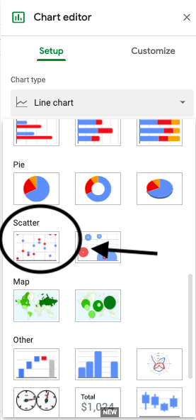
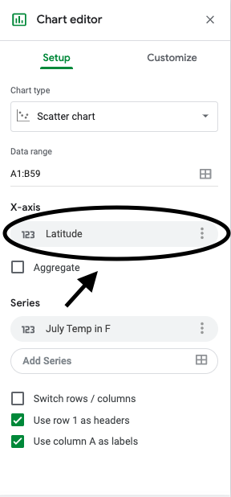
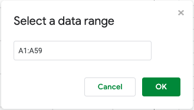
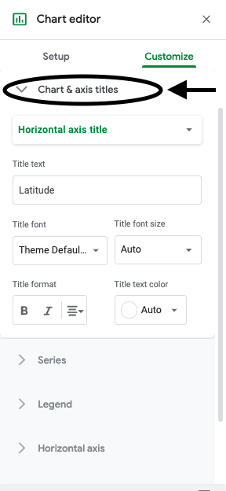
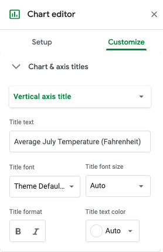

.. Copyright (C)  Google, Runestone Interactive LLC
    This work is licensed under the Creative Commons Attribution-ShareAlike 4.0
    International License. To view a copy of this license, visit
    http://creativecommons.org/licenses/by-sa/4.0/.

Creating a Scatter Plot in Sheets 
=================================

In this section, you will learn how to make a scatter plot in Sheets. You will 
work with the temperature data. Latitude will be the explanatory variable, and
July mean temperature will be the explained variable. 

How to make a scatter plot
--------------------------

First, copy over the city, state, latitude and July mean temperature columns 
from the weather data here into a new sheet.

.. image:: figures/create_a_scatter_copy_data.png
   :alt: A screenshot of a Sheet with the weather data's city, state, latitude, and July.
   :align: center 

Afterwards, select the two columns containing the latitude and mean temperature
data then click “Insert > Charts.”

.. image:: figures/create_a_scatter_insert_chart.png
   :alt: A screenshot of how to insert a chart. 
   :align: center 

Then in the chart editor click “Setup > Chart type > Scatter.”

Sometimes Sheets will correctly assign the columns to be either the explanatory
variable or the explained variable, but it is always good to know how to 
manually assign them. 

Go to “Chart Editor > X-axis > Edit ” to choose which column of data will be 
the explanatory variable. 

Then put in the range of cells where you put the latitude data (the explanatory
variable). 

To choose which column of data will be the explained variable, you will go 
through a similar process. Go to “Chart Editor > Series > Edit.”

.. image:: figures/create_a_scatter_yaxis1.png 
   :alt: A screenshot of how to choose the dependent variable data. 
   :align: center 

Then put in the range of cells where you put the weather data (the explained 
variable). 

.. image:: figures/create_a_scatter_yaxis2.png
   :alt: A screenshot of how to specify the cell range of the dependent variable.
   :align: center 

To add a title, go to “Chart Editor > Customize > Title.”

.. image:: figures/create_a_scatter_title.png
   :alt: A screenshot of how to change a chart's title. 
   :align: center 

To choose the horizontal and vertical axis labels, go to 
“Chart Editor > Customize > Chart & axis title.”

Then select “Horizontal axis title” and “Vertical axis title” respectively to 
add a descriptive horizontal axis label and a descriptive vertical axis label.

.. image:: figures/create_a_scatter_horizontal_label.png
   :alt: A screenshot of how to change the horizontal axis title. 
   :align: center 

You now have a scatter plot for latitude versus July mean temperature. Using 
the scatter plot, answer the questions below. 

Question: What city represents the point furthest to the right on the
scatter plot?

::

   A: Seattle

Question: What city represents the point closest to the y-axis on the
scatter plot?

::

   A: Miami-Hialeah
