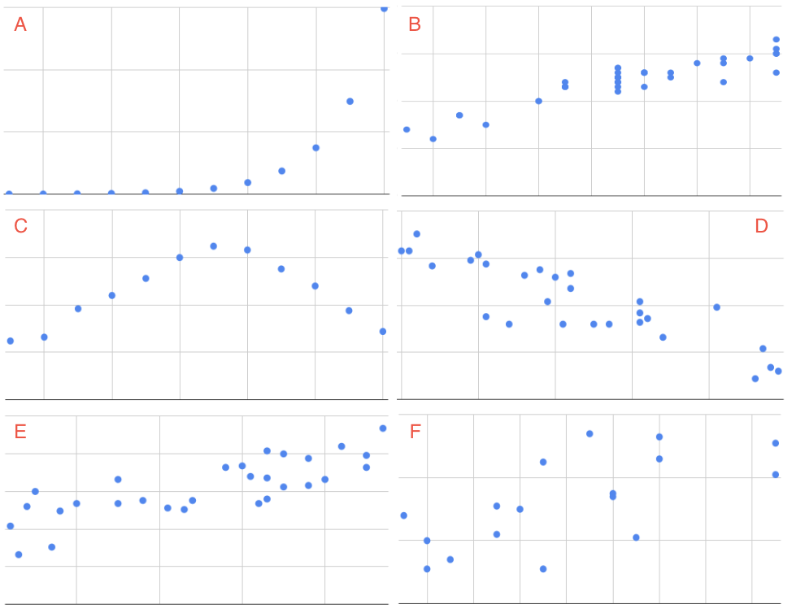
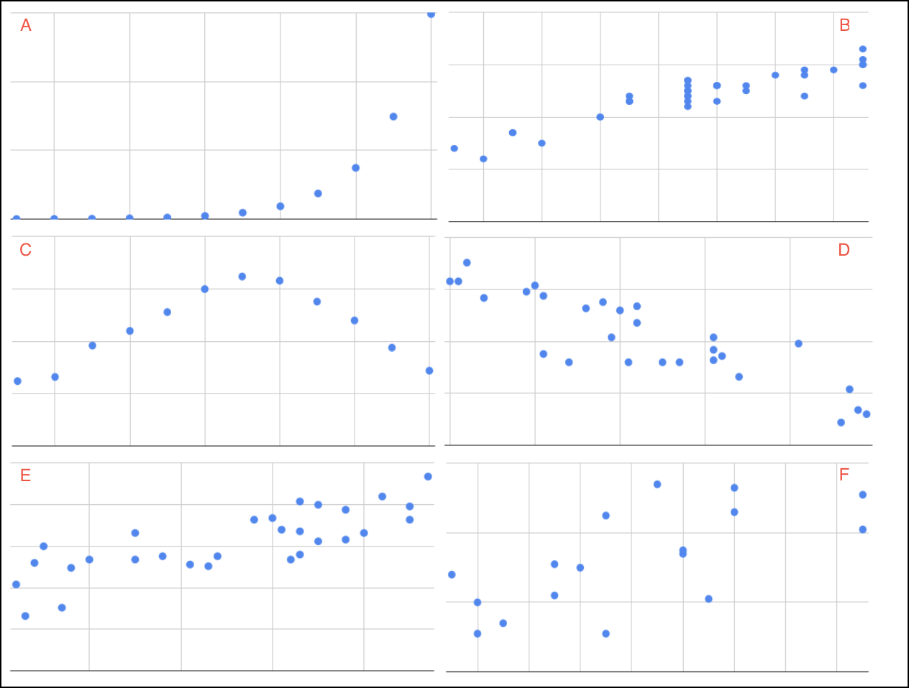

.. Copyright (C)  Google, Runestone Interactive LLC
    This work is licensed under the Creative Commons Attribution-ShareAlike 4.0
    International License. To view a copy of this license, visit
    http://creativecommons.org/licenses/by-sa/4.0/.

Describing Scatter Plots
========================

In this section you will learn how to identify the relationship between
variables in a scatterplot. These variables are the **explanatory** and the
**explained** variable that were by defined earlier in the 
:ref:`scatterplots section<scatter_plots>`. The following activities ask you
to examine the scatterplots pictured and then match them with their description.

.. mchoice:: identify_scatterplot_1

   The explanatory variable (x) is age in years and the explained variable (y) is the annual salary for a sample of working adults between the ages of 18 and 65.

  - E

    + Correct: Most adults make more money as they get older, but there are many other factors, like education and career that also impact salary.

  - A

    - Incorrect 

  - D

    - Incorrect 
  
  - F

    - Incorrect

.. mchoice:: identify_scatterplot_2

   The explanatory variable (x) is the mean commute time in minutes and the explained variable (y) is height in inches for a sample of employees at a small company.

  - F

    + Correct: There’s no real relationship between height and commute time.

  - A

    - Incorrect 

  - D

    - Incorrect 

  - B

    - Incorrect 

.. mchoice:: identify_scatterplot_3

   The explanatory variable (x) is the month of the year, starting in January, and the explained variable (y) is the mean temperature for that month for St. Louis, Missouri which has cold winters and warm summers.

  - C

    + Correct: Cold winters and warm summers means smaller values close to the end points 1 = January and 12 = December, and higher temperatures in the middle.

  - A

    - Incorrect 

  - D

    - Incorrect 

  - B

    - Incorrect 

.. mchoice:: identify_scatterplot_4

   The explanatory variable (x) is the city miles per gallon and the explained variable (y) is the highway miles per gallon for a sample of cars.

  - C

    - Incorrect

  - A

    - Incorrect 

  - D

    - Incorrect 

  - B

    + Correct: Cars with higher city mpg also have higher highway mpg. 

.. mchoice:: identify_scatterplot_5

   The explanatory variable (x) is the number of hours after e-coli has been introduced to a petri dish and the explained variable (y) is the estimated number of e-coli cells after t hours. The number of cells doubles about every 20 minutes.

  - C

    - Incorrect

  - A

    + Correct: Because the number of cells is doubling, the change every 20 minutes at the beginning of the experiment is small compared to the change every 20 minutes at the end of the experiment when there are much more cells dividing. 

  - D

    - Incorrect 

  - B

    - Incorrect 

.. mchoice:: identify_scatterplot_6

  The explanatory variable (x) is the years of driving experience and the explained variable (y) is the insurance premium paid for a sample of drivers.
    
  - C

    - Incorrect
    
  - A

    - Incorrect: 
    
  - D
    
    + Correct: Drivers with more driving experience are considered safer, so they pay smaller premiums. Similarly, drivers with less driving experience are considered riskier and pay greater premiums. 
    
  - B
    
    - Incorrect 

This exercise would be simpler given uniform adjectives that everyone could
understand. When describing the shape of the scatter plot and the relationship
between the explanatory and explained variable, there are three important
features to discuss.

-  The **direction** of a scatter plot can be described as positive or
   negative. The direction is positive when the explained variable
   increases as the explanatory variable increases, or the points of the
   scatterplot go up from left to right. The direction is negative when
   the explained variable decreases as the explanatory variable
   increases, or the points of the scatterplot go down from left to
   right.
-  The **strength** of a scatter plot is usually described as weak,
   moderate or strong. The more spread out the points are, the weaker
   the relationship. If the points are clearly clustered, or closely
   follow a curve or line, the relationship is described as strong.
-  The **linearity** of scatter plot indicates how close the points are
   to a straight line. Scatter plots are described as linear or
   nonlinear.

.. image:: figures/january_scatterplot.png
      :align: center
      :alt: A scatterplot depicting the temperature in January across latitudes.

For example, the scatterplot of latitude and January temperatures had
negative direction, as the greater the latitude, the colder the
temperature. Though there are a few :ref:`outliers<outliers_and_skew>` (cities
along the northwest coast of the US that have temperate winters, such as 
Portland, OR) there is a strong, linear trend.

Given a new set of scatterplots below, repeat the same exercise, but now with 
the new descriptions of strength, linearity and direction.

.. dragndrop:: dnd_scatterplot
   :feedback: Try again!
   :match_1: A|||Positive, strong, nonlinear
   :match_2: B|||Positive, strong, linear
   :match_3: C|||Neither positive nor negative, strong, nonlinear
   :match_4: D|||Negative, moderate, linear
   :match_5: E|||Positive, moderate, linear
   :match_6: F|||No relationship

   Match each scatterplot above with its description.

