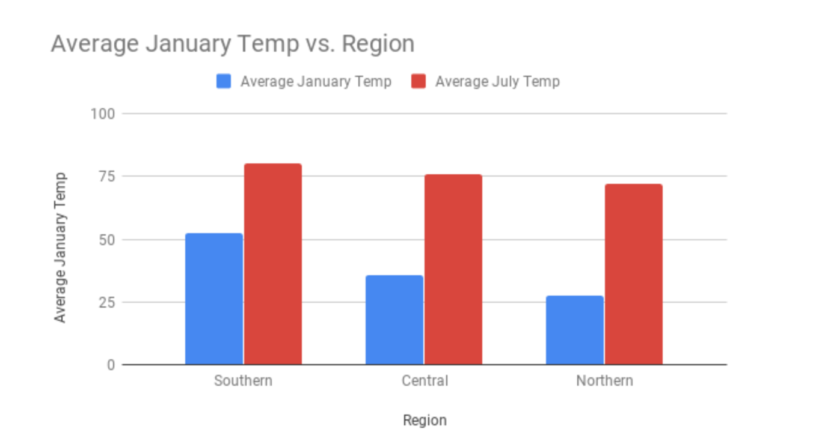

.. Copyright (C)  Google, Runestone Interactive LLC
   This work is licensed under the Creative Commons Attribution-ShareAlike 4.0
   International License. To view a copy of this license, visit
   http://creativecommons.org/licenses/by-sa/4.0/.

Motivating Scatterplots
=======================

Weather is something that changes based on location. Cities closer to the north
and south pole are generally pretty cold, while cities close to the equator are
generally pretty warm. But what if you wanted to quantify this relationship in
order to make specific predictions? Instead of saying “cities are generally
colder closer to the north pole," you could say, “as latitude increases by 10
degrees, temperature decreases by 20 degrees.”

Given the `following dataset`_ with `latitude, longitude`_, and weather data for
different cities in the United States, you can use histograms to plot latitudes
and temperatures independently as shown below.

.. image:: figures/lat_temp_histograms.png
   :align: center
   :alt: Two histograms side by side. One is of of latitudes of major cities in the US, the other is of temperatures in January.

Notice that this shows you the distribution of each variable alone, but tells
you nothing about the overall relationship between latitude and temperature.
How can you investigate the relationship with the tools you have?

Since you know that temperature is related to location, you could group the
cities based on their latitude, and then compare the mean temperature for each
group. Comparing the means for each group will quantify if and how much latitude
impacts temperature.

A latitude closer to 0 degrees means a city is closer to the equator, and a
latitude closer to 45 degrees means a city is closer to the poles. For cities in
the northern hemisphere, like those in the USA, smaller latitudes indicate
southern cities, and larger latitudes indicate northern cities. `See here for a
map of the USA with latitude and longitude lines.`_

You can split up cities in the United States into three regions, “Northern,”
“Southern,” and "Central" to more easily analyze the data. Most cities in the
continental states are between 25 and 50 degrees, so to group these, you can
label cities south of 35 degrees latitude “Southern”, cities north of 40 degrees
latitude “Northern,” and those in the middle “Central.” This choice is somewhat
arbitrary, but it breaks the cities into three fairly even groups.

Break down these cities into these three separate groups by using the ``IF``
function. Add a new column labelled location. Then create a formula as shown in
the screenshot below to group the cities.

.. image:: figures/city_region_breakdown.png
   :align: center
   :alt: A screenshot of a Sheet with a formula to sort latitudes into the three regions.

Which region do you think will have the highest January temperatures? What about
the lowest July temperatures? Now, double check your predictions by finding the
mean temperatures of each of the three regions. You can do this by using the
``AVERAGEIF`` function :ref:`(from the section on grouping)<grouping_data>`.

.. image:: figures/avg_if.png
   :align: center
   :alt: A screenshot of a Sheet calculating the average January temperatures of each region.

Now that you have found the mean temperature answer the following questions:

.. mchoice:: mean_temperature_jan

   What was the mean January temperature for cities in the Central region?
   (Rounded to the nearest whole number)

   - 36

     + Correct

   - 20

     - Incorrect

   - 27

     - Incorrect

   - 33

     - Incorrect

.. mchoice:: mean_temperature_jul

   What was the mean January temperature for cities in the Central region?
   (Rounded to the nearest whole number)

   - 75

     + Correct

   - 71

     - Incorrect

   - 68

     - Incorrect

   - 77

     - Incorrect

.. mchoice:: difference_mean

   Which region has the largest difference between its January mean temperature
   and its July mean temperature?

   - Northern

     + Correct

   - Central

     - Incorrect

   - Southern

     - Incorrect

Functions like ``AVERAGEIF`` are a great way to calculate the mean for a
specific region and/or month. But what if you want to see, in one visualization,
the mean temperature for January and July across all regions? To do this, you
can use a bar chart.

.. mchoice:: difference_regional

   Looking at the visualization, which month has a bigger regional difference in
   temperatures?

   - January

     + Correct

   - July

     - Incorrect

Although the above method is useful to determine the mean temperatures of
different regions in the United States, it is not the most accurate since it
applies over the whole region. For example, take the two cities Dayton, Ohio and
Memphis, Tennessee. Both of these cities are in the Central region, but Dayton
has a latitude of 39.54 degrees, while Memphis has a latitude of 35.07 degrees,
which are quite different. Based on what you’ve learned, you could probably make
an educated guess about which of these locations are colder in January, but how
could you get a better prediction of what the temperature may be? This is where
scatterplots will come in handy.

.. _following dataset: https://docs.google.com/spreadsheets/d/1ZmEmZwed-kGdDUDhxCxCzXtYLa4hRKZVoeRVQ5Cqo-M/edit?usp=sharing
.. _latitude, longitude: https://en.wikipedia.org/wiki/Geographic_coordinate_system
.. _See here for a map of the USA with latitude and longitude lines.: https://pasarelapr.com/images/map-of-usa-with-lines-of-latitude-and-longitude/map-of-usa-with-lines-of-latitude-and-longitude-2.jpg
